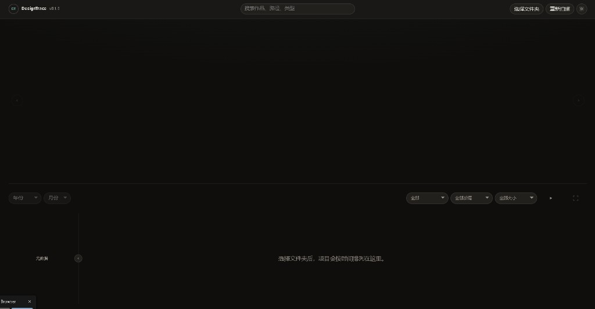

# DesignTrace

**简体中文** · **[English](README.en.md)**

本地设计项目时间轴浏览器 — 选择文件夹、预览作品、按时间回顾创作轨迹。

---

## 截图



*深色主题 — 顶部工具栏、预览区、时间轴筛选、左侧日历与底部状态栏。*

| 区域 | 说明 |
|------|------|
| 顶栏 | 选择文件夹、搜索、主题切换 |
| 中部 | 大图预览与幻灯片 |
| 底部 | 年月筛选、范围与后缀筛选、时间轴卡片 |
| 左侧 | 月度活跃日历 |

> 选择文件夹后，时间轴会显示项目卡片与预览图。

---

## 简介

DesignTrace 是一款纯前端 Web 应用：通过浏览器 **File System Access API** 读取本地文件夹，将**根目录下第一层子文件夹**视为一个项目，并在可交互的时间轴、大图预览和月度日历中展示创作活动。

所有处理均在浏览器本地完成，**不会上传任何文件**。

## 在线体验与下载

| | 链接 |
|---|---|
| **在线** | https://wonvy.github.io/DesignTrace/ |
| **下载** | https://github.com/Wonvy/DesignTrace/releases/latest/download/DesignTrace.html |
| **CDN 备用** | https://cdn.jsdelivr.net/gh/Wonvy/DesignTrace@main/DesignTrace.html |

首次启用 GitHub Pages：**仓库 Settings → Pages → Build and deployment → Source：GitHub Actions**。  
推送 `main` 后自动部署，**无需**选择 `gh-pages` 分支。

## 环境要求

- **浏览器：** Chrome 或 Edge（需支持 File System Access API）
- **访问方式：** 须通过 `http://localhost` 或 `https://` 打开（不能直接用 `file://`）
- **Node.js：** 18+（仅用于本地静态服务与构建脚本）

## 快速开始

```bash
npm start
```

浏览器打开 `http://127.0.0.1:8080`（若 8080 被占用，端口会自动递增）。

1. 点击 **选择文件夹**，授权浏览器读取目录。
2. 时间轴上出现项目卡片，点击可预览图片与文件列表。
3. 左侧日历与顶部年/月选择器可按时间段浏览。

## 文件夹组织方式

你选择的根目录下，**每个直接子文件夹**对应一个项目。更深层级的子文件夹会递归扫描其中的文件，但**不会**再单独注册为项目。

支持的命名示例：

| 格式 | 示例 | 时间轴日期来源 |
|------|------|----------------|
| 编号 + 名称 | `870 家书` | 设计源文件（PSD、AI 等）或文件夹内文件修改时间 |
| 名称含日期 | `24年3月15日 项目名` | 从文件夹名解析，可被文件时间覆盖 |
| 普通名称 | `My Project` | 文件夹内文件修改时间 |

编号命名时：标题显示 **家书**，副标题显示 **#870**。

## 功能概览

- **时间轴** — 拖拽、缩放、自动播放，卡片最多展示 4 张最近图片
- **日历热力图** — 按月展示项目活跃程度
- **筛选** — 范围、后缀、图片大小（选项会缓存到 `localStorage`，刷新后保留）
- **大图幻灯** — 主预览区、右侧文件列表、全屏自动播放
- **主题** — 浅色 / 深色，可跟随系统或手动切换
- **路径** — 界面以 Windows 反斜杠 `\` 显示；点击状态栏路径可复制
- **本地记忆** — 上次文件夹、选中项目、筛选条件、主题、热力图折叠状态

## 筛选器说明

| 选项 | 含义 |
|------|------|
| 全部 | 显示所有项目 |
| 同父文件夹 | 与当前选中项目同一父目录 |
| 同根目录 | 与当前项目路径第一段相同（适用于有中间层级的结构） |
| 仅顶层 | 仅显示根下第一层项目（与「全部」在现行扫描规则下通常一致） |
| 仅子文件夹 | 仅显示有父路径的项目（不适用于「870 家书」这类根下一层结构） |

## 命令

| 命令 | 说明 |
|------|------|
| `npm start` | 启动本地静态服务（默认 `127.0.0.1:8080`） |
| `npm run build:single` | 构建单文件 `dist/DesignTrace.html` |
| `npm run check` | 检查 `server.js` 与 `public/app.js` 语法 |

## 单文件构建

```bash
npm run build:standalone
```

输出 `dist/DesignTrace.html`。会自动内联 `public/index.html` 引用的全部 CSS/JS；若产出仍含外部 `<script src>` 或 `<link rel="stylesheet">` 则构建失败。

## GitHub Pages 与 Releases

**Pages** — 推送 `main` → [pages.yml](.github/workflows/pages.yml) 通过 **GitHub Actions** 部署（站点根目录为 `index.html`）。

**Release** — 推送版本标签 → [release.yml](.github/workflows/release.yml) 上传 `DesignTrace.html`：

```bash
git push origin main
git tag v1.0.0
git push origin v1.0.0
```

## 目录结构

```
DesignTrace/
├── public/           # 前端源码
├── scripts/
│   ├── build-standalone.js
│   └── build-single-html.js
├── dist/             # 构建产物
├── .github/workflows/
│   ├── pages.yml
│   ├── release.yml
│   └── ci.yml
├── docs/
│   └── screenshots/
├── server.js
└── package.json
```

## 隐私说明

仅在用户授权后读取本地文件夹，数据不离开本机，无统计上报与远程存储。

## 许可证

私有原型项目（`package.json` 中 `"private": true`）。对外发布时请自行调整许可方式。
